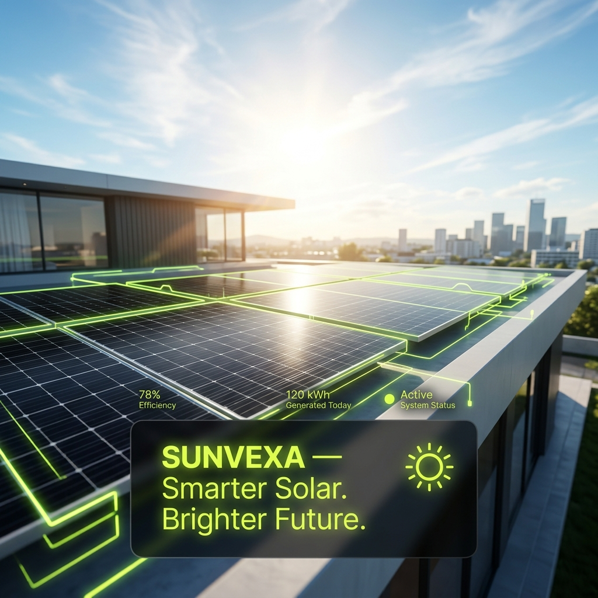
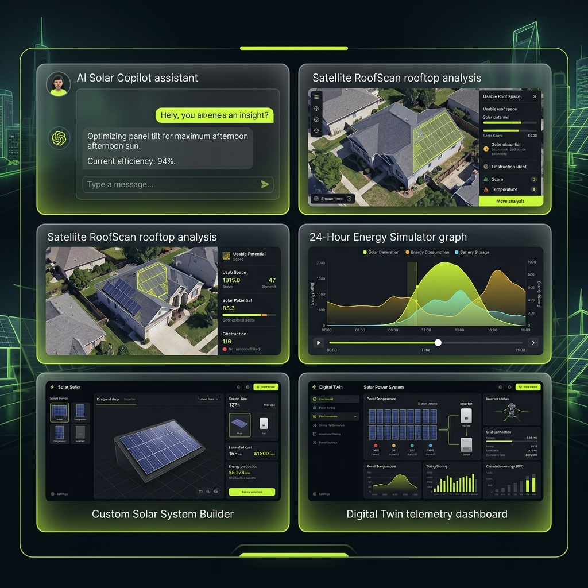
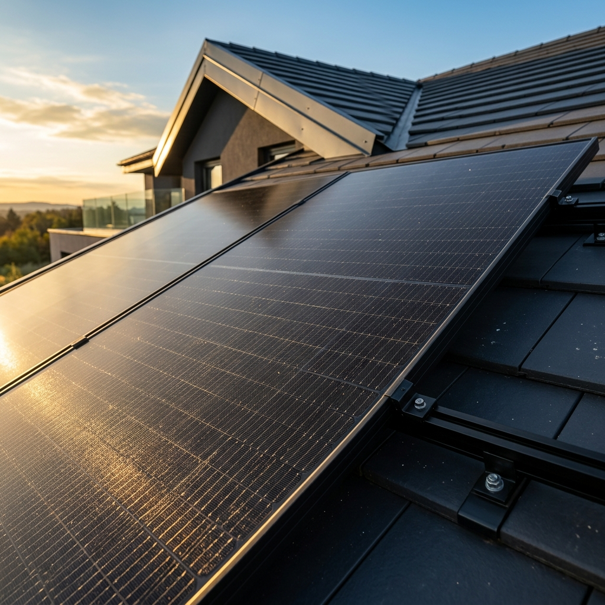
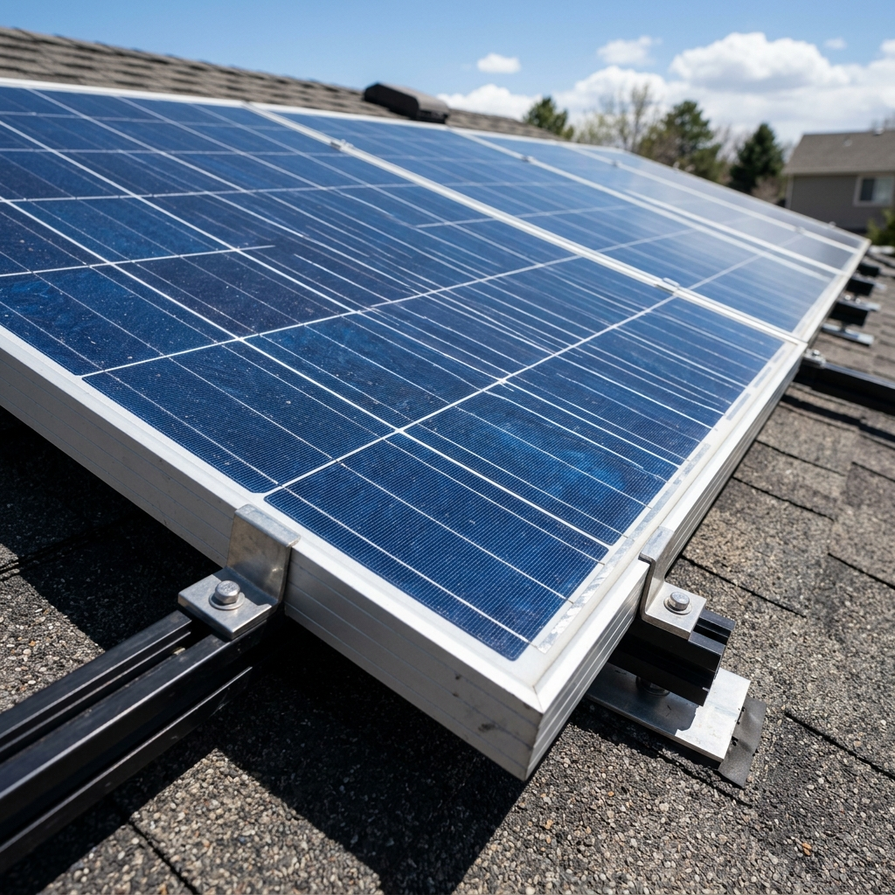

<div align="center">

# ☀️ SUNVEXA — Smarter Solar. Brighter Future.



**Next-Generation Clean-Tech E-Commerce & Solar Systems Platform**

[](https://reactjs.org/)
[](https://spring.io/projects/spring-boot)
[](https://www.postgresql.org/)
[](https://www.oracle.com/java/)
[](https://jwt.io/)

</div>

---

## 🌟 Executive Overview

**SUNVEXA** is a enterprise-grade clean-tech e-commerce platform built to simplify rooftop solar adoption for residential and commercial property owners. It merges high-performance 3D canvas animation with intelligent sizing calculators, conversational AI guidance, and an end-to-end 6-step purchase & live order tracking engine.

---

## ⚡ 5 Advanced Clean-Tech Features



### 1. 🎬 240-Frame Canvas Scroll Animation
- **60 FPS Rendering**: Smooth 3D solar array sequence dynamically bound to scroll position.
- **Aspect Ratio Optimization**: Dynamic `cover` math preventing letterboxing on all resolutions.

### 2. 🤖 AI Solar Copilot Engine
- **Conversational Clean-Tech Guidance**: Intelligent chatbot providing optimal panel wattage, inverter sizing, and 25-year ROI estimates.

### 3. 🛰️ RoofScan AI Satellite Analysis
- **Preliminary Sizing**: Satellite surface area, tilt angle, and 92% sun irradiance index evaluation.

### 4. ⚡ 24-Hour Energy Simulator
- **Hourly Profiling**: Interactive generation vs. consumption load curves comparing battery storage and grid net-metering.

### 5. 🛠️ Custom System Builder & Solar Digital Twin
- **Component Assembly**: Drag-and-drop hardware compatibility checks (Panels, Inverters, Battery Banks).
- **Digital Twin**: Live telemetry modeling system output, battery state of charge, and CO₂ offset.

---

## 🔬 Solar Panel Technology Showcase

<div align="center">

| Monocrystalline PERC | Polycrystalline Heavy-Duty |
| :---: | :---: |
|  |  |
| **SUNVEXA Apex 550W** • 22.8% Efficiency | **SUNVEXA UltraSolar 530W** • 20.4% Efficiency |

</div>

---

## 🏗️ Enterprise Architecture

```text
 ┌────────────────────────────────────────────────────────┐
 │           FRONTEND LAYER (Vite + React 18)             │
 │  • TypeScript  • Tailwind CSS  • HTML5 Canvas Engine   │
 └───────────────────────────┬────────────────────────────┘
                             │ REST API (JSON / Port 8080)
                             ▼
 ┌────────────────────────────────────────────────────────┐
 │       BACKEND LAYER (Java 21 + Spring Boot 3.4)        │
 │  • Controller  • Service  • Repository  • DTO  • JWT   │
 └───────────────────────────┬────────────────────────────┘
                             │ JPA / Hibernate
                             ▼
 ┌────────────────────────────────────────────────────────┐
 │            DATABASE LAYER (PostgreSQL 18)              │
 │  • Flyway Migrations  • Indexed Tables  • BCrypt Hashes │
 └───────────────────────────┴────────────────────────────┘
```

---

## 🛒 Transparent 6-Step Purchase Engine

```text
[1. REVIEW PRODUCT] ➔ [2. CUSTOMER DETAILS] ➔ [3. DELIVERY & INSTALLATION]
                                                          │
[6. ORDER TRACKING]  [5. CONFIRMATION]    [4. PAYMENT PROCESS]
```

1. **Review Product**: Verify panel wattage, efficiency ratings, warranty terms, and unit pricing.
2. **Customer Details**: Validates full contact info, shipping address, city, state & PIN code.
3. **Delivery & Installation**: Option for **Product Only** or **Turnkey Rooftop Site Installation (+₹25,000)**.
4. **Demo Payment**: Payment gateway simulation (`UPI`, `Credit/Debit Card`, `Net Banking`).
5. **Order Confirmation**: Order record persisted in PostgreSQL `sunvexa_db` with stateful price snapshotting.
6. **Live Order Tracking**: Real-time 6-phase timeline tracking progress by order number (e.g. `SNR-89421`).

---

## 🔐 Security & Database Management

- **Stateless JWT Security**: Custom `JwtAuthenticationFilter` validating HMAC-SHA512 signed Bearer tokens.
- **BCrypt Encryption**: Passwords encrypted with BCrypt strength 10 prior to persistence in PostgreSQL `users` table.
- **Database Schema Versioning**: Flyway DDL migration engine (`V1__init_schema.sql`, `V2__seed_data.sql`).

---

## 🚀 Getting Started

### Prerequisites
- Node.js 18+ & npm
- JDK 21+ & Maven 3.9+
- PostgreSQL 18 service running locally on port 5432 (`sunvexa_db`)

### 1. Frontend Setup
```bash
npm install
npm run dev
```
Website runs at: **`http://localhost:5173/`**

### 2. Backend Setup
```bash
cd backend
mvn spring-boot:run
```
REST API runs at: **`http://localhost:8080/api`**  
Interactive Swagger UI Docs: **`http://localhost:8080/swagger-ui.html`**

---

<div align="center">

**SUNVEXA** — *Smarter Solar. Brighter Future.*

</div>
